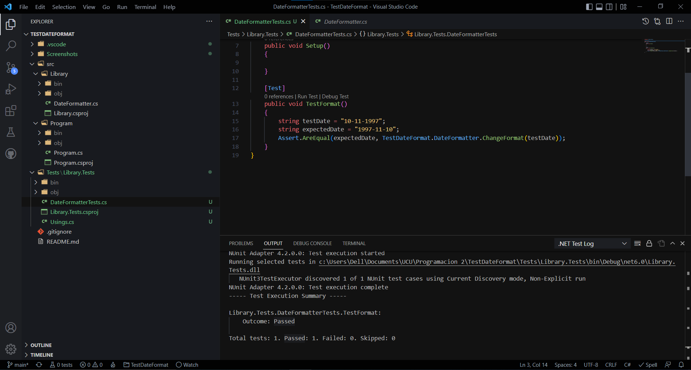
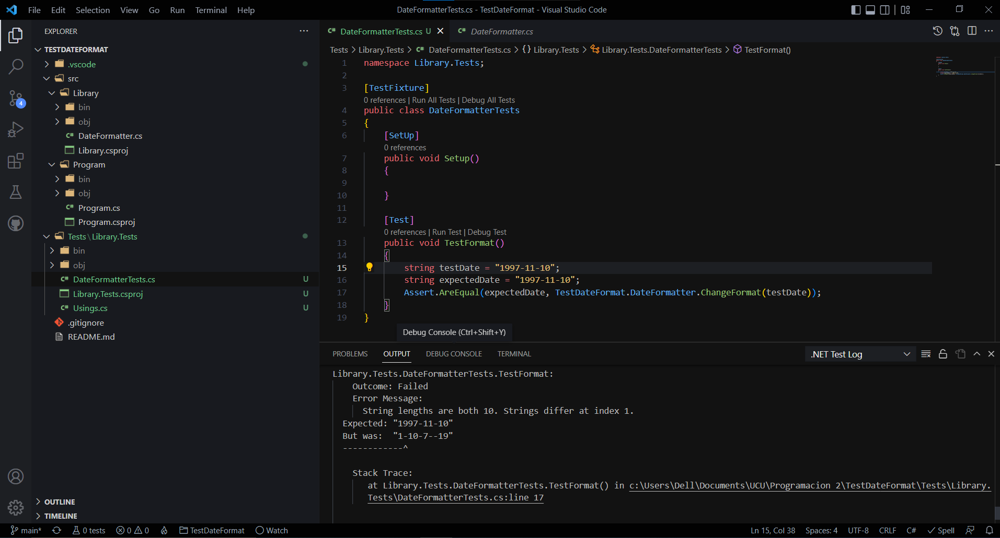
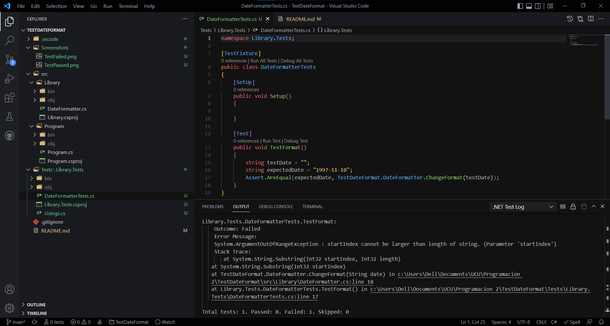

# Universidad Católica del Uruguay

## Facultad de Ingeniería y Tecnologías
### Programación II

## Ejercicio de testing de DateFormat

Se crearon casos de prueba para comprobar el funcionamiento de la función 'ChangeFormat' y se obtuvieron los siguientes resultados.

1. Utilizando el formato que la función espera que ingresemos:

2. Utilizando un formato diferente al que la función espera recibir.

3. Pasando como parámetro una string vacía

En base a estos resultados se optó por actualizar dicha función para prever todas estas situaciones.

Ahora la función retorna "Error, ingrese el formato correcto." si se ingresa una fecha incorrecta.